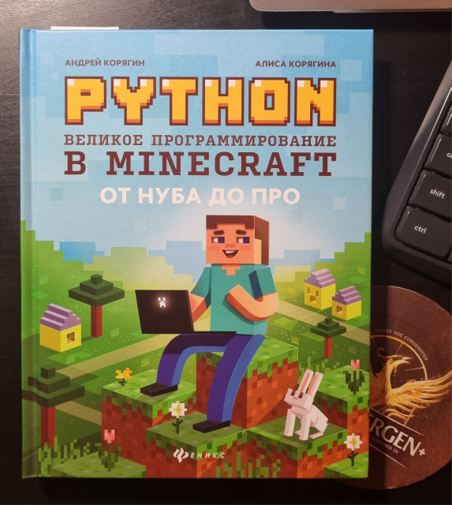
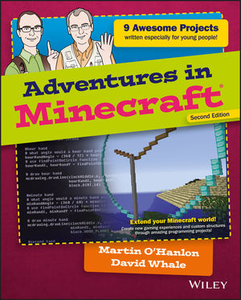

# Программирование на Python в Minecraft

Содержит файлы для успешного запуска сервера **Spigot** для Майнкрафт, подключения среды программирования **Python**.
Основано на материалах и примерах из книг: 
* _"Python. Программирование в Minecraft"_ ([репозиторий](https://github.com/Antipat/python_minecraft)) 
* _"Adventures in Minecraft"_ ([репозиторий](https://www.stuffaboutcode.com/p/adventures-in-minecraft.html))

Материалы книг несколько устарели, и сделать все по инструкции было проблематично.
Этот репозиторий - кратчайший путь попробовать программировать на Питоне в Майнкрафте самому.
Книга «_Adventures in Minecraft_» представляется более серьезно подготовленной.

|  |  |
|----------------------------------------------------------------|----------------------------------------------------------------|


## Установка
Распаковать этот репозиторий в папку типа
	`C:\dev_programs\MyMinecraftPrograming`
	
### Минимальный набор для запуска

**Minecraft**
* Официальная версия - https://www.minecraft.net/ru-ru
* Опционально TLauncher - https://tlauncher.org/


**Java JDK 17**
* https://www.oracle.com/java/technologies/downloads/#java17
* x64 Installer	- https://download.oracle.com/java/17/latest/jdk-17_windows-x64_bin.exe
	
**Python 3.11.5**
* Среда разработки
  * https://www.python.org/
  * https://www.python.org/downloads/release/python-3115/
  * Должна появиться среда разработки "IDLE Shell"

	`print("123") Команда работает.`	

## Установка и запуск

* Запустить "**StartSpigot.bat**"

Если сервер не запустится с первого раза, можно проверить 
**"Установка с проверкой репозиториев"**


## Поключение Minecraft к серверу и запуск Python примеров

* Запускаем сервер **\StartSpigot.bat**
* Запускаем Майнкрафт
* Подключаемся к серверу - **localhost**
* Мы оказываемся в мире

* Открываем Python IDLE
* Копируем программы-уроки в папку \AdventuresInMinecraft
* Открываем файл программы File/Open например
  **\AdventuresInMinecraft\HelloMinecraftWorld.py**
* Запускаем программу /Run/Run module (F5)
* Возвращаемся к окно игры, наблюдаем результат.
* Запускаем другие программы

## Установка с проверкой репозиториев

Версии майнкрафта и компонентов меняются, 
какие-то компоненты могут устареть и перестать работать.
Реализовать подключение можно через проверку и обновление 
компонентов сервера


**Уроки из книги - "Adventures in Minecraft"**

* Уроки к книге "Adventures in Minecraft", внутри также подробная инструкция к установке и уроки 
* https://www.stuffaboutcode.com/p/adventures-in-minecraft.html
* Уроки - https://www.wiley.com/WileyCDA/Section/id-823690.html
* Код - https://media.wiley.com/assets/7266/39/CodeFiles.zip
* Starter Kit PC - https://media.wiley.com/assets/7266/45/AIMStarterKitPC.zip
* **\readme.txt** - Вместо серверов для майнкрафта, указанных в инструкции **[Bukkit](https://minecraft.fandom.com/ru/wiki/Bukkit)** и **Canarymod** использовался актуальный **Spigot**
		
**Сервер Майнкрафта — Spigot 1.20.1 (последняя версия)**
* https://minecraft.fandom.com/ru/wiki/Spigot
* https://getbukkit.org/download/spigot
https://download.getbukkit.org/spigot/spigot-1.20.1.jar
* Качаем и создаем папку **\Spigot** 
* внутри создаем файл \Spigot\ **start.bat**

Содержимое \Spigot\ **start.bat**
```
@echo off

"java.exe"^
 -Xmx1024M -Xms1024M -jar^
 "spigot-1.20.1.jar"

PAUSE		
```
, где 
* **"java.exe"^** - полный путь до Java 17, например **"C:\Program Files\Java\jdk-17\bin\java.exe"^**
* **"spigot-1.20.1.jar"** - Полный путь или имя приложения сервера
			
* После первого запуска батник должен выкачать файлы и ругнуться,что EULA не заполнен.
* В папке появиться файл - \Spigot\ **eula.txt**
* Меняем в нем текст - "**eula=false**" на "**eula=true**"
* Запускаем снова. Должно запуститься. 
* Создастся мир и сервер начнет ждать запросов на подкючение
* Остановить сервер - команда "**stop**"
		
**Настройки сервера**

* \Spigot\ **server.properties** - Настройки сервера
* [Описание свойств](https://www.spigotmc.org/wiki/spigot-configuration-server-properties/) 

```
     -  gamemode=0  to  gamemode=1  to change the server from survival mode to creative. / survival (0), creative (1) or adventure (2) mode.
     -  force-gamemode=false  to  force-gamemode=true  to make all players play in creative mode.
     -  spawn-monsters=true  to  spawn-monsters=false  so monsters mobs won t appear in the game.
     -  allow-flight=false  to  allow-flight=true  so you can fly in Minecraft.
     - "online-mode=true  to  online-mode=false  so you don t need to be connected to the internet to use Bukkit
```
	
В майнкрафте можно подключиться к работающему серверу по адресу - "**localhost**"
		
**RaspberryJuice Version 1.12.1 (последний на момент запуска)**
* Выкачиваем плагин для связи обычного майнкрафта и Питона
* берем JAR файл и кладем в папку сервера - Spigot\plugins\raspberryjuice-1.12.1.jar
* https://www.spigotmc.org/resources/raspberryjuice.22724/
* https://github.com/zhuowei/RaspberryJuice
* После перезапуска сервер должен подключить плагин
* Команда "**plugins**" консоли сервера - покажет установленные плагины
		
**Выкачиваем уроки в папку**

* \CodeFiles
* \AdventuresInMinecraft
  * \anyio
  * \mcpi
  * findPort.py

Чтобы уроки работали, нужно файлы ***.py** из подпапок **\CodeFiles** Перекинуть в папку **\AdventuresInMinecraft**
, например **\CodeFiles\Adventure4\vanishingBridge.py** скопировать в **\AdventuresInMinecraft\vanishingBridge.py**

**Minecraft: Pi edition API Python Library**

* Последняя версия библиотеки - **mcpi** (берем только папку mcpi)
* Выкачиваем репозиторий и обновляем папку mcpi в папке исходников вот так - \AdventuresInMinecraft\mcpi
* Python library for communicating with Minecraft: Pi edition and RaspberryJuice.
* https://github.com/martinohanlon/mcpi
		
**anyio - A GPIO Python module, that works on many platforms.**

* Последняя версия библиотеки - anyio (берем папку anyio и файл findPort.py)
* Выкачиваем репозиторий и обновляем папку anyio в папке исходников вот так - \AdventuresInMinecraft\anyio
* https://github.com/whaleygeek/anyio

		
**Алгоритм запуска и проверки**

* Установили и выкачали репозитории.
* Настроили \Spigot\ **start.bat** с правильными путями до java и до **spigot-1.20.1.jar**
* Сервер запускается, плагин **raspberryjuice-1.12.1.jar** установлен
* Уроки выкачана и лежат в папках **\AdventuresInMinecraft**, **\CodeFiles**
		
**Проверить плагины на сервере**

* Команда "plugins" консоли сервера - вернет список установленных плагинов, должен быть "RaspberryJuice"
```
    >plugins
    [21:31:15] [Server thread/INFO]: Plugins (1): RaspberryJuice
```
		
## Об ошибках
* [Ошибка подбора порта](https://spigotmc.ru/threads/python-stranno-vedet-sebja-api.3431/)
* [You Need to Agree to the EULA](https://www.minecraftforum.net/forums/support/server-support-and/2773329-eula-true-you-need-to-agree-to-the-eula)
* [Java Versions Error](https://stackoverflow.com/questions/76689380/java-runtime-class-file-version-61-0-this-version-of-the-java-runtime-only-re)

## Смотри также
* [Habr - Увлекательное программирование: изучаем Minecraft](https://habr.com/ru/companies/piter/articles/280023/)
* [Книга «Minecraft. Программируй свой мир». Вэйл Д., О`Хэнлон М.](https://habr.com/ru/companies/piter/articles/269757/)
* [Книга. «Python. Великое программирование в Minecraft»](https://vc.ru/u/659760-andrey-koryagin/241472-kniga-python-velikoe-programmirovanie-v-minecraft)

Репозитории

* [AdventuresInMinecraft/AdventuresInMinecraft-PC](https://github.com/AdventuresInMinecraft/AdventuresInMinecraft-PC)
* [AdventuresInMinecraft/AdventuresInMinecraft.github.io](https://github.com/AdventuresInMinecraft/AdventuresInMinecraft.github.io)
* [Antipat/Mathematic-in-minecraft](https://github.com/Antipat/Mathematic-in-minecraft)
* [Antipat/python_minecraft](https://github.com/Antipat/python_minecraft)
* [VitekIndustrial/minecraft-art](https://github.com/VitekIndustrial/minecraft-art)
* [VitekIndustrial/minecraft-art-in-minecraft-world](https://github.com/VitekIndustrial/minecraft-art-in-minecraft-world)
